# Geoscience Attribution Benchmarks
Attribution Benchmarks for Geoscience Modeling

## Overview

Coming soon

## Related publications

[Neural network attribution methods for problems in geoscience: A novel synthetic benchmark dataset](https://www.cambridge.org/core/journals/environmental-data-science/article/neural-network-attribution-methods-for-problems-in-geoscience-a-novel-synthetic-benchmark-dataset/DDA562FC7B9A2B30710582861920860E)

    @article{mamalakis2022neural,
      title={Neural network attribution methods for problems in geoscience: A novel synthetic benchmark dataset},
      author={Mamalakis, Antonios and Ebert-Uphoff, Imme and Barnes, Elizabeth A},
      journal={Environmental Data Science},
      volume={1},
      pages={e8},
      year={2022},
      publisher={Cambridge University Press}
    }

[Investigating the Fidelity of Explainable Artificial Intelligence Methods for Applications of Convolutional Neural Networks in Geoscience](https://journals.ametsoc.org/view/journals/aies/1/4/AIES-D-22-0012.1.xml)

    @article{mamalakis2022investigating,
      title={Investigating the fidelity of explainable artificial intelligence methods for applications of convolutional neural networks in geoscience},
      author={Mamalakis, Antonios and Barnes, Elizabeth A and Ebert-Uphoff, Imme},
      journal={Artificial Intelligence for the Earth Systems},
      volume={1},
      number={4},
      pages={e220012},
      year={2022}
    }

## Quick start

### Example: Create a synthetic dataset based on SST Anomaly data

Data source: https://psl.noaa.gov/data/gridded/data.cobe2.html

**Download SST data**

    mkdir data 
    cd data 
    wget https://downloads.psl.noaa.gov//Datasets/COBE2/sst.mon.mean.nc
    cd ..

**Calculate covariance matrix from samples**

    python utils/get_sst.py \
        -n data/sst.mon.mean.nc \   # Path to SST data
        -c out/sst_cov.npz \        # To save covariance
        -p out/sst.png \            # To save plot of selected sample
        -i 0                        # Index to select sample to plot

**Generate synthetic samples using covariance matrix**

    python benchmarks/benchmark_from_covariance.py \
        -c out/sst_cov.npz \        # Path to SST covariance data
        -n 100000 \                 # Number of synthetic samples
        -o out/sst_samples.npz      # To save the synthetic samples

**Plot generated samples**

    python utils/plot_samples.py \
        -r out/sst_samples.npz \      # Synthetic SST anomaly samples
        -i 0,2,4,6,8 \                # Indices to plot 
        -o out/sst_samples_plot.png   # Where to save plot

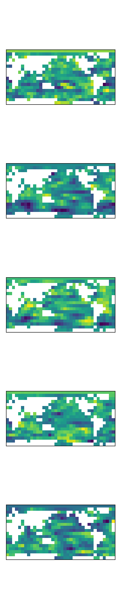

### Example: Create a synthetic dataset based on storm-centered tornado images

Data source: https://github.com/djgagne/ams-ml-python-course

**Download tornado data**

    cd data
    wget https://storage.googleapis.com/track_data_ncar_ams_3km_nc_small/track_data_ncar_ams_3km_nc_small.tar.gz
    tar -xvzf track_data_ncar_ams_3km_nc_small.tar.gz
    cd ..

**Calculate covariance matrix from samples**

    python utils/get_tornado.py \
        -n data/track_data_ncar_ams_3km_nc_small/NCARSTORM_20170323-0000_d01_model_patches.nc,data/track_data_ncar_ams_3km_nc_small/NCARSTORM_20170329-0000_d01_model_patches.nc   # Comma-delimited storm patch files
        -o out/tornado_cov.npz         # To save covariance

**Generate synthetic samples using covariance matrix**o

    python benchmarks/benchmark_from_covariance.py \
        -c out/tornado_cov.npz \        # Path to tornado covariance data
        -n 50000 \                      # Number of synthetic samples
        -o out/tornado_samples.npz      # To save the synthetic samples

**Plot generated samples**

    python utils/plot_samples.py \
        -r out/tornado_samples.npz \      # Synthetic SST anomaly samples
        -i 5,6,7,8,9 \                    # Indices to plot 
        -o out/tornado_samples_plot.png   # Where to save plot

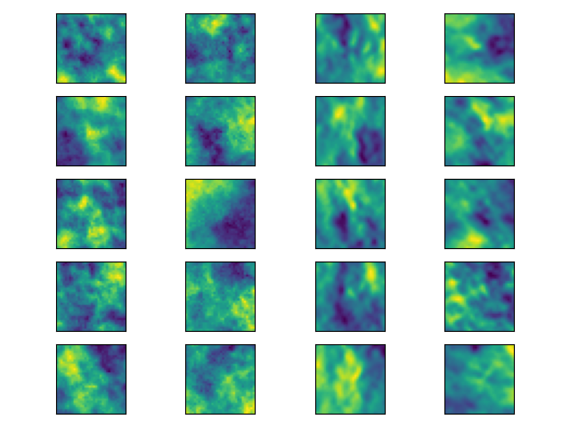
    

### Example: create 2D sythnetic benchmark with autocorrelation using commands

**View example commands file**

    cat data/cmds_example_2D.dat
    RASTER samples=10 rows=50 cols=50 bands=1
    SEED coords=10,10 value=0.2 threshold=0.9 decay=0.01 value_dist=0.2
    SEED coords=20,20 value=0.6 threshold=0.9 decay=0.01
    SEED coords=40,20 value=0.8 threshold=0.9 decay=0.01 value_dist=0.3
    DILATE size=2,2 structure=2,2

**Generate synthetic samples**

    python benchmarks/benchmark_from_commands.py \
        -f data/cmds_example_2D.dat \    # Path to commands
        -o out/cmds_example_2D.npz       # To save synthetic samples

**Plot generated samples**

    python utils/plot_samples.py \
        -r out/cmds_example_2D.npz \     # Synthetic samples
        -i 0,1 \                         # Indices to plot
        -o out/cmds_example_2D.png       # Where to save plot

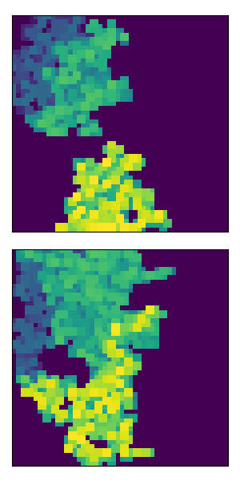

### Example: create 3D synthetic benchmark with spatial autocorrelation across channels

**View example commands file**

    cat data/cmds_example_3D-spatial.dat
    RASTER samples=10 rows=50 cols=50 bands=6
    SEED coords=10,10,3 value=0.2 threshold=0.9 decay=0.01 value_dist=0.2
    SEED coords=20,20,3 value=0.6 threshold=0.9 decay=0.01
    SEED coords=40,40,3 value=0.8 threshold=0.9 decay=0.04 value_dist=0.05
    SEED coords=40,30,3 value=0.9 threshold=0.9 decay=0.04 value_dist=0.05

**Generate synthetic samples**

    python benchmarks/benchmark_from_commands.py \
        -f data/cmds_example_3D-spatial.dat \    # Path to commands
        -o out/cmds_example_3D-spatial.npz       # To save synthetic samples

**Plot generated samples**

    python utils/plot_samples.py \
        -r out/cmds_example_3D-spatial.npz \     # Synthetic samples
        -i 0,1 \                                 # Indices to plot
        -o out/cmds_example_3D-spatial.png       # Where to save plot

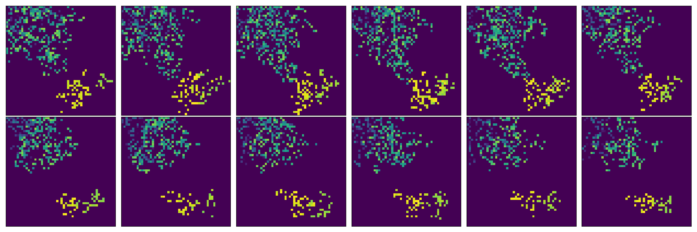

**Plot an interactive volume rendering**

    python utils/render_raster.py \
        -f out/cmds_example_3D-spatial.npz \  # Synthetic samples
        -i 2                                  # Sample index to view

### Example: create a 3D synthetic benchmark with temporal autocorrelation across channels

This example converts a single-channel rasters to multi-channel where each channel
represents the spatial data at subsequent discrete time steps. The vector field 
contains the x and y components for movement at each cell. These vectors are used
to shift the cells for each time step. 

**Obtain a vector field**

- The vector field is raster data with shape `(2, rows, cols)`.
- Where the 2-length first dimension organizes x and y components, respectively.
- It should be stored as a numpy `.npz` file.
- There is a provided example file `out/example_timeseries.npz`. 
- In the future, we'll provide some tools for generating these. 

**Plot vector field**

    python utils/plot_vectorfield.py \
        -v data/example_vectorfield.npz \   # Path to input vector field
        -o out/example_vectorfield.png      # To save plot

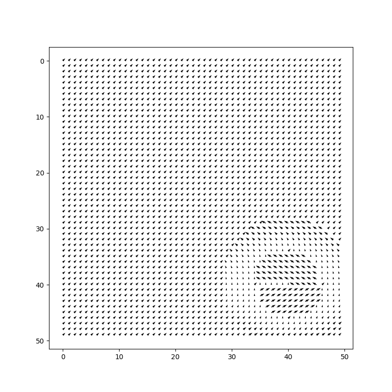

**Generate synthetic samples**

    python benchmarks/benchmark_from_vectorfield.py \
        -r out/example_of_expanded.npz \      # Path to input raster 
        -v data/example_vectorfield.npz \     # Path to input vector field
        --time_steps 6 \                      # Number of time steps to generate
        -o out/example_timeseries.npz         # To save output raster samples

**Plot generated samples**

    python utils/plot_samples.py \
        -r out/example_timeseries.npz \      # Synthetic samples
        -i 0 \                               # Indices to plot
        -o out/example_timeseries.png        # Where to save plot

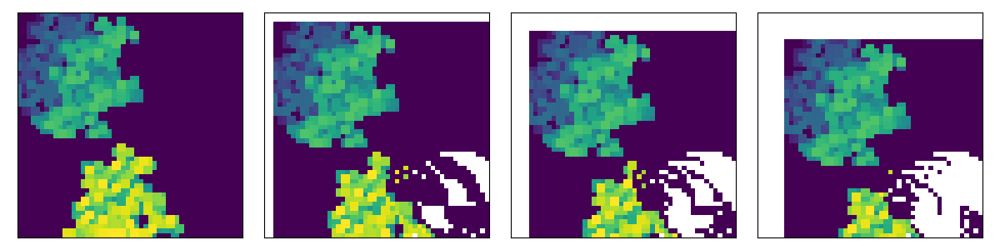

**Crop the samples**

Shifting causes the boundaries to be NaNs.

    python utils/crop_rasters.py \
        -i out/example_timeseries.npz \        # Path to input raster
        -o out/example_timeseries_crop.npz \   # To save cropped raster
        --high_row 42 \                        # Lower index of rows 
        --low_col 8                            # Lower index of cols

    python utils/plot_samples.py \
        -r out/example_timeseries_crop.npz \   # Synthetic samples
        -i 0 \                                 # Indices to plot
        -o out/example_timeseries_crop.png     # Where to save plot

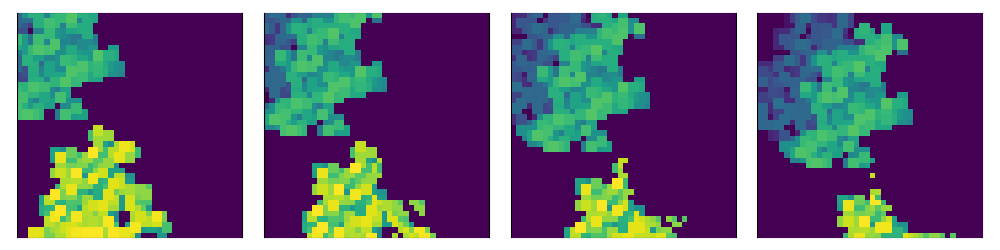

### Example: create a 4D (packaged as 3D) synthetic benchmark with temporal and spatial autocorrelation across channels

This example is created by using a 3D vector field with `(x, y, z)` motion components that is applied to a multi-channel raster. That is, a 3D volume is converted to a time series based on the motion commands at multiple discrete time steps. The result is 4D data: (rows, cols, channels, time steps). 

However, many deep learning architectures assume a (rows, cols, channels) input shape. So it is not uncommon to package the 4D data as a 3D raster. That means that the 3D volume and time steps are interleaved together, breaking up the autocorrelation. For a real example, see the [FogNet 3D CNN for coastal fog prediction](https://gridftp.tamucc.edu/fognet/).

**Obtain a vector field**

- The vector field is raster data with shape (3, rows, cols, bands).
- Where the 3-length first dimension organizes x, y and z components, respectively. 
- It should be stored as a `.npz` file.
- There is an example file `out/example_timeseries_3D.npz`
- In the future, expect tools to generate these.

**Plot vector field**

    python utils/plot_vectorfield.py \
        -v data/example_vectorfield_3D.npz \   # Path to input vector field
        -o out/example_vectorfield_3D.png  \   # To save plot
        -d 5                                   # Divide by this to plot fewer arrows

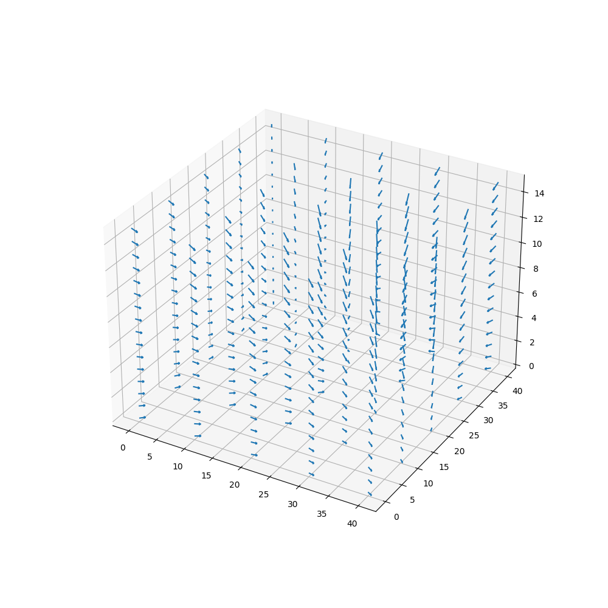

**Generate synthetic samples: 3D volume**

Before applying the vector field, we'll make another set of 3D volume samples. The dimensions need to be larger than required for the final benchmark since the application of the vectorfield will create NaNs on the edges in rows, cols and bands.

    python benchmarks/benchmark_from_commands \
        -f data/cmds_example_3D-spatial_2.dat \     # Path to commands
        -o out/cmds_example_3D-spatial_2.npz        # To save synthetic samples

    python utils/render_raster.py \
        -f out/cmds_example_3D-spatial_2.npz \   # Synthetic samples
        -i 0                                     # Sample index to view

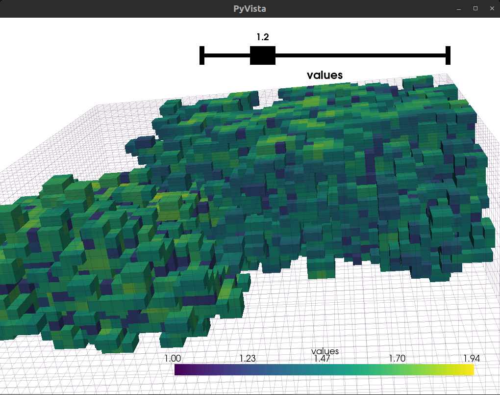

**Generate synthetic samples: time series**

    python benchmarks/benchmark_from_vectorfield.py \
        -r out/cmds_example_3D-spatial_2.npz \             # Path to input raster
        -v data/example_vectorfield_3D.npz \               # Path to input vector field
        --time_steps 4 \                                   # Number of time steps to generate
        -o out/cmds_example_3D-spatial-timeseries.npz      # To save output raster samples

Since the vector field pushes points toward the bottom and middle, we can see the size of the raster decrease dramatically with each time step. Since we generated 4 time steps, the three time steps are concatenated together.

    python utils/render_raster.py \
        -f out/cmds_example_3D-spatial-timeseries.npz \    # Synthetic samples
        -i 0                                               # Sample index to plot

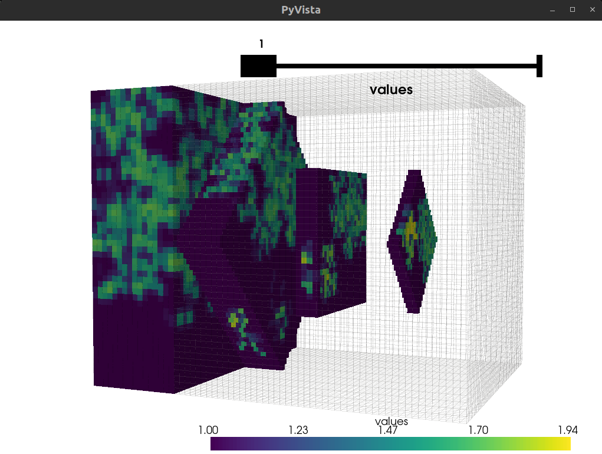

**Crop**

If the vector field moves the pixels a lot, you may need to crop much of the data to get complete (non-NaN) data. It makes sense that you need a larger region of the earth for processes to happen than the smaller region your (synthetic) sensor captured. In this example, we started with a 16-channel volume and end up with only 2 channels. With 4 time steps, a raster with 8 channels total. 

Here, we need to crop the bands for each time step separately. Otherwise, does not make sense to remove from bottom of t0 and from top of tN. We use the `--band_keys_varname` option to specify the name of a variable name within the input `.npz` file that leads to a list of tuples of (band, timestep) that lets the program apply the band-wise cropping to each time step's volume separately. These are then concatenated together for output. The `band_keys` is added to the `.npz` file when using multi-channel data as input to `benchmarks/benchmark_from_vectorfield.py`.

    python utils/crop_rasters.py \ 
        -i out/cmds_example_3D-spatial-timeseries.npz \    # Path to input raster
        -o cmds_example_3D-spatial-timeseries.npz \        # To save cropped raster
        --band_keys_varname band_keys \                    # Name of `.npz` var with band, timestep keys
        --low_row 19 \                                     # Lower index of rows
        --high_row 31 \                                    # Higher index of rows
        --low_col 19 \                                     # Lower index of cols
        --high_col 31 \                                    # Higher index of cols
        --high_band 2                                      # Higher index of bands

    python utils/render_raster.py \
        -f out/cmds_example_3D-spatial-timeseries_crop.npz \    # Synthetic samples
        -i 0                                                    # Sample index to plot

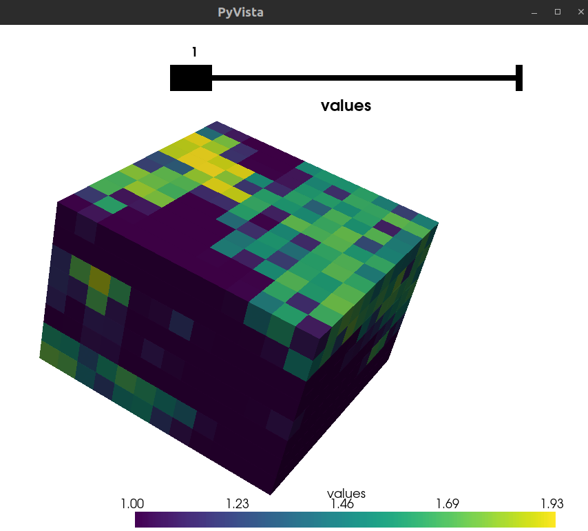

## Benchmark Functions (with known attribution maps)

### Example: define a piece-wise linear function based on SST anomaly

    python benchmarks/pwl_from_samples.py \
        -s out/sst_samples.npz \              # Path to input samples
        -k 10 \                               # Number of PWL breakpoints 
        -o out/sst_pwl-out.npz \              # To save outputs & attributions
        -f out/sst_pwl-fun.npz \              # To save the PWL functions (weights, edges)
        -p 0,1,2,3 \                          # Sample indices to plot with attributions
        --plot_cell_idxs 1,100,200            # PWL functions to plot (for debugging)

**Attribution maps**

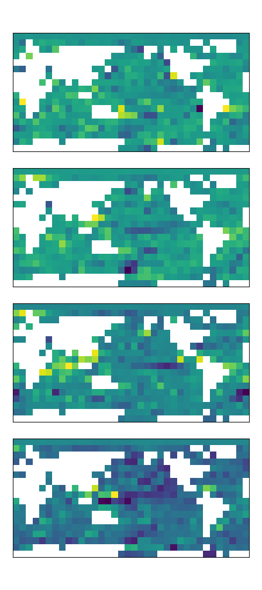

**Piece-wise linear functions**

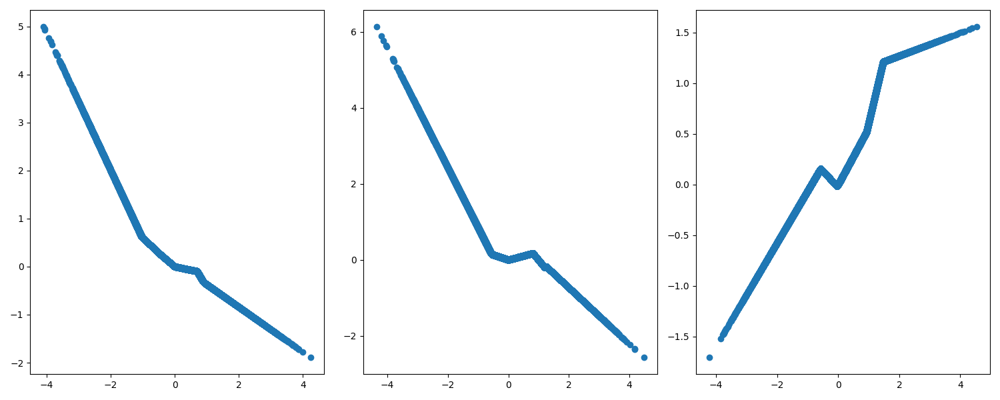

### Example: define a piece-wise linear function based on storm-centered images

    python benchmarks/pwl_from_samples.py \
        -s out/tornado_samples.npz \          # Path to input samples
        -k 6 \                                # Number of PWL breakpoints
        -o out/tornado_pwl-out.npz \          # To save outputs & attributions
        -f out/tornado_pwl-fun.npz \          # To save the PWL functions (weights, edges)
        -p 0,1,2,3,4,5 \                      # Attribition indices to plot
        --plot_cell_idxs 0,2,4                # PWL functions to plot (for debugging)

**Attribution maps**
    
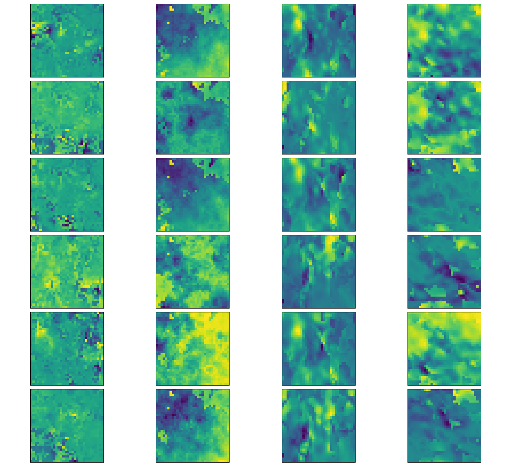

**Piece-wise linear functions** 

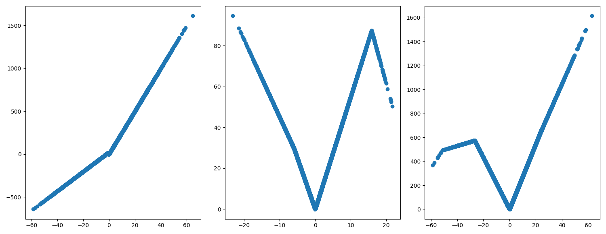

## Extra Utilities
 
### Example: expand raster dimensions

Most of these tools assume a `.npz` file with a variable that contains an
array with shape (samples, rows, cols, bands). This tool is used to expand
the dimensions of the raster, either on the left or right. 

    python utils/expand_dims.py \
        -i out/example_of_2D_shape.npz \   # Path to input raster
        -o out/example_of_expanded.npz \   # To save reshaped raster
        --expand_left \                    # Choice to expand on left axis
        --expand_right                     # Choice to expand on right axis

### Example: concatenate 2 rasters along the channels

Many models take in multi-channel rasters where the channels might not be related to other other. That is, there is no spatial or temporal meaning to their adjacency. We can create synthetic samples like this by generating distinct samples and then concatenating them along the channels. 

    python utils/cat_rasters.py \
        -a out/cmds_example_2D.npz \         # Raster A
        -b out/cmds_example_3D-spatial.npz \ # Raster B
        -o out/cmds_example_concat.npz       # Concat (A, B)

### Example: crop a raster

    python utils/crop_rasters.py \
        -i out/cmds_example_2D.npz \     # Path to input raster
        -o out/cmds_example_crop.npz \   # To save cropped raster
        --low_row 10 \                   # Lower index of rows 
        --high_row 40                    # Higher index of rows

### Example: Reorder a raster's bands

    python utils/reorder_rasters.py \
        -i out/cmds_example_3D-spatial.npz \    # Path to input raster
        -o out/cmds_example_reordered.npz \     # To save reordered raster
        -r 5,4,2,1                              # Specified band order (skips allowed)

