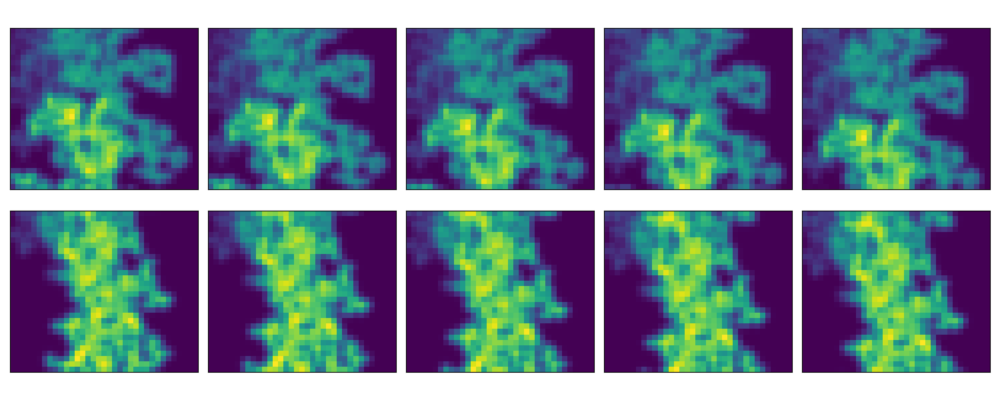

# Geoscience Attribution Benchmarks
Attribution Benchmarks for Geoscience Modeling

## Overview

Coming soon

## Quick start

### Example: Create a synthetic dataset based on SST Anomaly data

Data source: https://psl.noaa.gov/data/gridded/data.cobe2.html

**Download SST data**

    mkdir data 
    cd data 
    wget https://downloads.psl.noaa.gov//Datasets/COBE2/sst.mon.mean.nc
    cd ..

**Calculate covariance matrix from samples**

    python utils/get_sst.py \
        -n data/sst.mon.mean.nc \   # Path to SST data
        -c out/sst_cov.npz \        # To save covariance
        -p out/sst.png \            # To save plot of selected sample
        -i 0                        # Index to select sample to plot

**Generate synthetic samples using covariance matrix**

    python benchmarks/benchmark_from_covariance.py \
        -c out/sst_cov.npz \        # Path to SST covariance data
        -n 10 \                     # Number of synthetic samples
        -o out/sst_samples.npz      # To save the synthetic samples

**Plot generated samples**

    python utils/plot_samples.py \
        -r out/sst_samples.npz \      # Synthetic SST anomaly samples
        -i 0,2,4,6,8 \                # Indices to plot 
        -o out/sst_samples_plot.png   # Where to save plot

### Example: Create a synthetic dataset based on storm-centered tornado images

Data source: https://github.com/djgagne/ams-ml-python-course

**Download tornado data**

    cd data
    wget https://storage.googleapis.com/track_data_ncar_ams_3km_nc_small/track_data_ncar_ams_3km_nc_small.tar.gz
    tar -xvzf track_data_ncar_ams_3km_nc_small.tar.gz
    cd ..

**Calculate covariance matrix from samples**

    python utils/get_tornado.py \
        -n data/track_data_ncar_ams_3km_nc_small/NCARSTORM_20170323-0000_d01_model_patches.nc,data/track_data_ncar_ams_3km_nc_small/NCARSTORM_20170329-0000_d01_model_patches.nc   # Comma-delimited storm patch files
        -o out/tornado_cov.npz         # To save covariance

**Generate synthetic samples using covariance matrix**o

    python benchmarks/benchmark_from_covariance.py \
        -c out/tornado_cov.npz \        # Path to tornado covariance data
        -n 10 \                         # Number of synthetic samples
        -o out/tornado_samples.npz      # To save the synthetic samples

**Plot generated samples**

    python utils/plot_samples.py \
        -r out/tornado_samples.npz \      # Synthetic SST anomaly samples
        -i 5,6,7,8,9 \                    # Indices to plot 
        -o out/tornado_samples_plot.png   # Where to save plot

    

### Example: create 2D sythnetic benchmark with autocorrelation using commands

**View example commands file**

    cat data/cmds_example_2D.dat
    RASTER samples=10 rows=50 cols=50 bands=1
    SEED coords=10,10 value=0.2 threshold=0.9 decay=0.01 value_dist=0.2
    SEED coords=20,20 value=0.6 threshold=0.9 decay=0.01
    SEED coords=40,20 value=0.8 threshold=0.9 decay=0.01 value_dist=0.3
    DILATE size=2,2 structure=2,2

**Generate synthetic samples**

    python benchmarks/benchmark_from_commands.py \
        -f data/cmds_example_2D.dat \    # Path to commands
        -o out/cmds_example_2D.npz       # To save synthetic samples

**Plot generated samples**

    python utils/plot_samples.py \
        -r out/cmds_example_2D.npz \     # Synthetic samples
        -i 0,1 \                         # Indices to plot
        -o out/cmds_example_2D.png       # Where to save plot

### Example: create 3D synthetic benchmark with temporal relationships across channels

**View example commands file**

    RASTER samples=10 rows=50 cols=50 bands=1
    SEED coords=10,10 value=0.2 threshold=0.9 decay=0.01 value_dist=0.2
    SEED coords=20,20 value=0.6 threshold=0.9 decay=0.01 value_dist=0.1
    SEED coords=40,20 value=0.8 threshold=0.9 decay=0.01 value_dist=0.3
    BLUR sigma=0.75
    TIMESHIFT direction_degrees=20 magnitude_pixels=2 num_shifts=5 random_dist=1
    CROP low_row=10 high_row=40 low_col=4 high_col=39

**Generate synthetic samples**

    python benchmarks/benchmark_from_commands.py \
        -f data/cmds_example_3D-temporal.dat \    # Path to commands
        -o out/cmds_example_3D-temporal.npz       # To save synthetic samples

**Plot generated samples**

    python utils/plot_samples.py \
        -r out/cmds_example_3D-temporal.npz \     # Synthetic samples
        -i 0,1 \                                  # Indices to plot
        -o out/cmds_example_3D-temporal.png       # Where to save plot

### Example: create 3D synthetic benchmark with spatial relationships across channels

**View example commands file**

**Generate synthetic samples**

    python benchmarks/benchmark_from_commands.py \
        -f data/cmds_example_3D-spatial.dat \    # Path to commands
        -o out/cmds_example_3D-spatial.npz       # To save synthetic samples

**Plot generated samples**

    python utils/plot_samples.py \
        -r out/cmds_example_3D-spatial.npz \     # Synthetic samples
        -i 0,1 \                                 # Indices to plot
        -o out/cmds_example_3D-spatial.png       # Where to save plot

## Extra Utilities

### Example: Concatenate 2 rasters along the channels

Many models take in multi-channel rasters where the channels might not be related to other other. That is, there is no spatial or temporal meaning to their adjacency. We can create synthetic samples like this by generating distinct samples and then concatenating them along the channels. 

    python utils/cat_rasters.py \
        -a out/cmds_example_2D.npz \         # Raster A
        -b out/cmds_example_3D-spatial.npz \ # Raster B
        -o out/cmds_example_concat.npz       # Concat (A, B)

### Example: crop a raster

    python utils/crop_rasters.py \
        -i out/cmds_example_2D.npz \     # Path to input raster
        -o out/cmds_example_crop.npz \   # To save cropped raster
        --low_row 10 \                   # Lower index of rows 
        --high_row 40                    # Higher index of rows
   
### Example: expand raster dimensions

Most of these tools assume a `.npz` file with a variable that contains an
array with shape (samples, rows, cols, bands). This tool is used to expand
the dimensions of the raster, either on the left or right. 

    python utils/expand_dims.py \
        -i out/example_of_2D_shape.npz \   # Path to input raster
        -o out/example_of_expanded.npz \   # To save reshaped raster
        --expand_left \                    # Choice to expand on left axis
        --expand_right                     # Choice to expand on right axis

