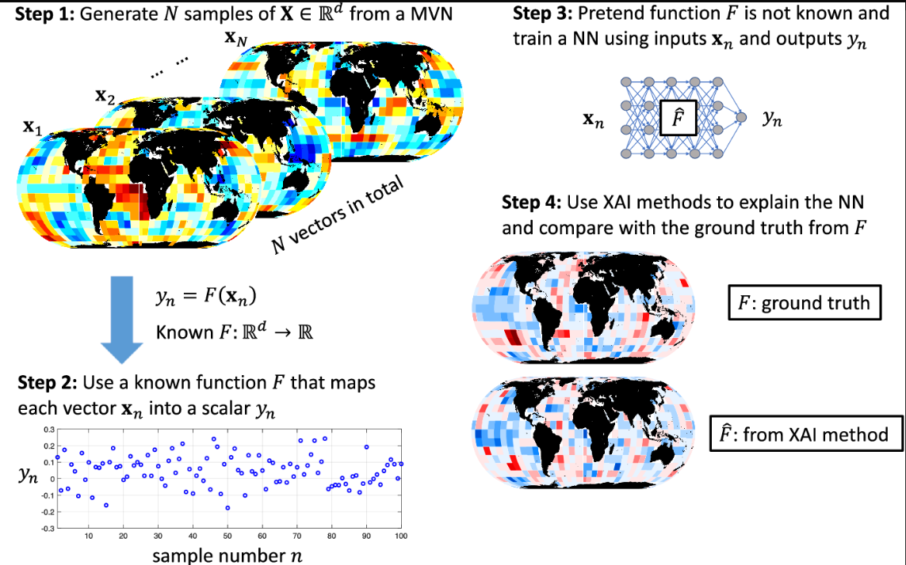
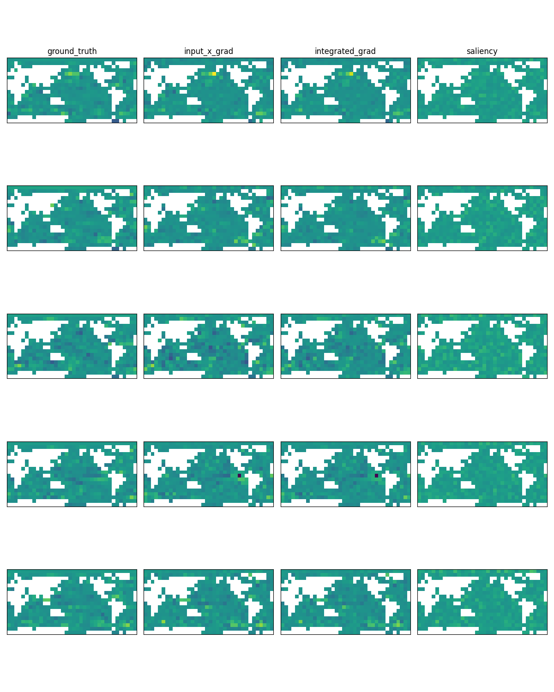

# Benchmark: SST Anomaly

This benchmark is an implementation of [Mamalakis et al. (2022)](https://www.cambridge.org/core/journals/environmental-data-science/article/neural-network-attribution-methods-for-problems-in-geoscience-a-novel-synthetic-benchmark-dataset/DDA562FC7B9A2B30710582861920860E), 
the publication that proposed this approach to XAI evaluation through synthetic benchmarks. 

The purpose is to quantitatively compare XAI methods based on the correlation between the XAI output and the attribution of a known function F. The synthetic function F is carefully designed to have (1) spatial relationships among the grid cells and (2) the ability to calculate the attribution of each grid cell toward the function's output. By generating a very large amount of synthetic samples, a neural network is trained to approiximate F. Since the NN achieves near-perfect performance (R-square > 0.999), it is assumed that the learned function is a good approximation of the known function F. So, differences between the attribution of F and the output of XAI methods is assumed to be **because of limitations in the XAI method** rather than differences between what the model learned and F. 

(For very highly correlated data, it would be possible to achieve a very high NN performance without approximating the original F. But that is not explored in this benchmark). 

**Caveats:**
- Just because of the computational expense, `config.json` sets the pipeline to generate 10^5 samples instead of 10^6 (as in Mamalakis et al.). With the latter, I needed to use a high-performance workstation.
- In Mamalakis et al.'s result, there is a higher mean correlation between XAI results and the known attribution. The pattern is the same: `input x gradient` and `integrated gradients` perform best and similarly, while `saliency` maps have practically no correlation with the known attribution. Still, the source of the difference in correlation magnitudes is under investigation.

## Benchmark Pipeline Diagram

_Image from [Mamalakis et al. (2022)](https://www.cambridge.org/core/journals/environmental-data-science/article/neural-network-attribution-methods-for-problems-in-geoscience-a-novel-synthetic-benchmark-dataset/DDA562FC7B9A2B30710582861920860E)_

## How to run

The pipeline options (which XAI methods, NN hyperparameters, etc) can be modified in `config.json`.

    bash benchmarks/sstanom/create_sstanom_benchmark.sh

There is also a script to plot several attribution maps to compare  

    dir=benchmarks/sstanom/out/

    python src/plot/plot_attributions.py \
        --attr_files  $dir/pwl-out.npz,$dir/xai/xai_input_x_gradient.npz,$dir/xai/xai_integrated_gradients.npz,$dir/xai/xai_saliency.npz \
        --sample_idxs 0,10,100,200,300.0,1,2,3,4.0,1,2,3,4.0,1,2,3,4 \
        --names ground_truth,input_x_grad,integrated_grad,saliency

## Alternative: Reuse Archived Benchmark

- Mamalakis has made the synthetic dataset available from the 2022 publication
- I have a script `csu_sstanom_benchmark.sh` that downloads this data and uses it for XAI
- It includes:
  - A set of 1,000,000 synthetic samples
  - The targets (y) and attributions from the known function
  - The trained TensorFlow model
- My script allows you to either:
  - Use the pretrained model for XAI
  - Train a new model from scratch
- Check the script to see what options are available

