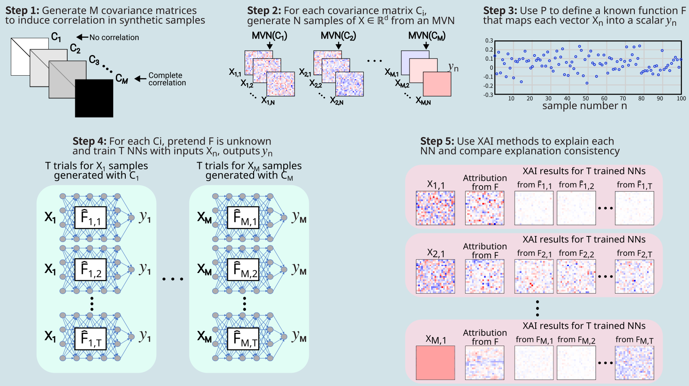
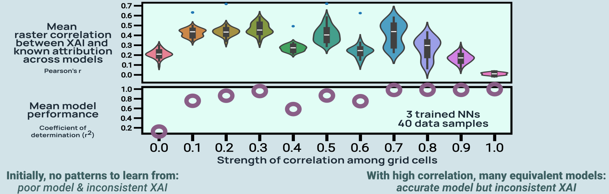
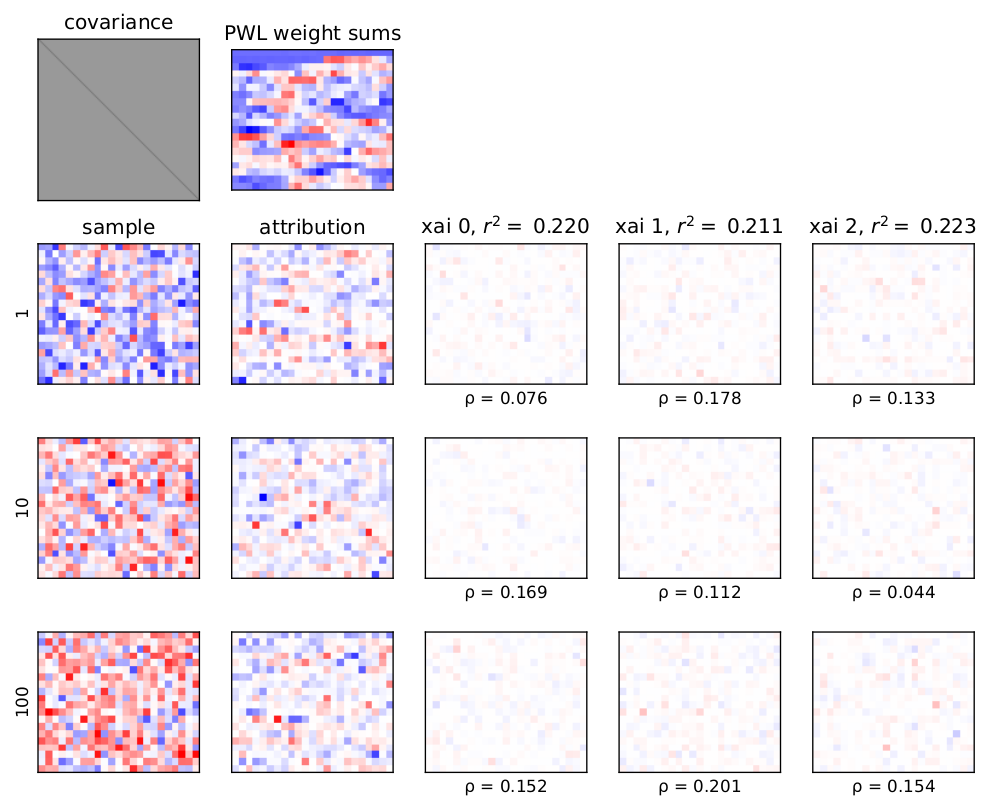
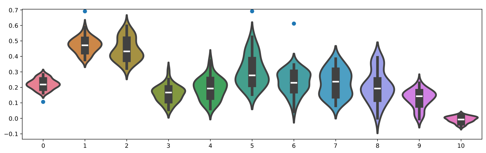
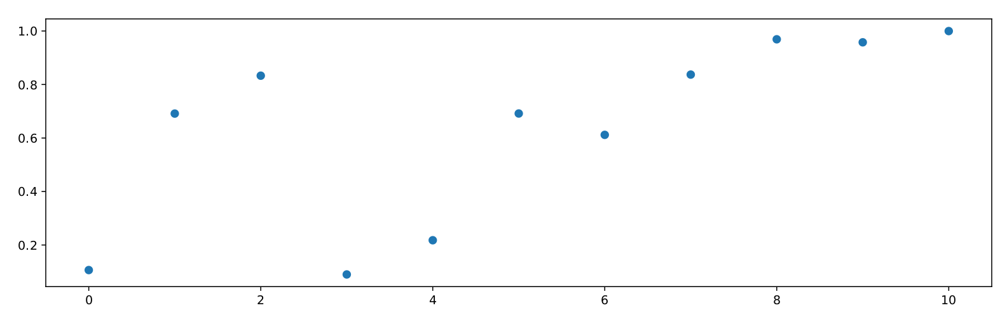

# Benchmark: Uniform Covariance Matrices

This is a very simple benchmark to demonstrate how the strength of correlation between grid cells influences the distribution of XAI results when retraining the model. 

- With correlated data, the model can learn different relationships and achieve similar performance.
- So, there is potential variation in the learned weights of the trained model.
- This means that the XAI outputs may also vary, even if they all correctly explain the model.
- This benchmark is really a set of benchmarks, where each benchmark uses a different covariance matrix.
- The covariance matrices are uniform: all grid cells have the same relationship.
- The covariances matrices used go from 0.0 (no correlation) to 1.0 (all values identical). 
- **Hypothesis: greater correlation --> greater variation in XAI results**. 

**Publication**

[Krell et al. (2024): Using Grouped Features to Improve Explainable AI Results for Atmospheric AI Models that use Gridded Spatial Data and Complex Machine Learning Techniques](https://ams.confex.com/ams/104ANNUAL/meetingapp.cgi/Paper/435616)

## Benchmark Design

## Motivating Toy Example

## Benchmark Design Pipeline

**Note on covariance matrix**

- For each benchmark, two covariance matrices are needed
  1. Used to generate the samples 
  2. Used to induce spatial relationships between grid cells when defining known function F
- Here, a _uniform covariance matrix_ is used to generate samples (e.g. where cov = 0.5)
- And a _real geospatial covariance matrix_ is used for the known function F
  - Otherwise, each experiment has **two changes** instead of isolating to just the influence on sample correlation
  - The real covariance matrix comes from **SST anomaly** data (see the `sstanom` benchmark)

## Results

## How to Run

### Build benchmarks

**Run the pipeline**

    bash benchmarks/unicov/create_unicov_benchmark.bash \
        benchmarks/unicov/config_bmark.json             \   # Config file for general benchmark options
        benchmarks/unicov/config_nn.json                    # Config file for the nueral net hyperparameters

**Plot comparisons of XAI to known attributions**

    # Use the output files to get list of covariance matrix indices
    cov_labels=$(ls benchmarks/unicov/out/nn_loss*.csv | grep -o nn_loss_[0-9]* | grep -o [0-9]* | uniq | sort -n)         
    echo ${cov_labels}

    # Loop over those indices to plot the XAI results for a given method
    for cidx in ${cov_labels[@]}; do
        python benchmarks/unicov/unicov_plot.py \
            --input_dir         benchmarks/unicov/out/   \   # Directory with unicov outputs
            --covariance_label  ${cidx}                  \   # Index of covariance matrix
            --xai_label         input_x_gradient         \   # Which performance metric to compare
            --output_file        benchmarks/unicov/out/xai/xai_compare_${cidx}.pdf
    done

Example: `xai_compare_4.pdf`

**Plot summary over entire set of benchmarks**

    python benchmarks/unicov/unicov_summary_plot.py \
        --input_dir   benchmarks/unicov/out/  \     # Directory with unicov outputs
        --xai_label   input_x_gradient        \     # Which XAI method to compare
        --metric      input_x_gradient        \     # Which performance metric to compare
        --output_corr_file   benchmarks/unicov/out/xai/corr_compare_summary.pdf  \
        --output_perf_file   benchmarks/unicov/out/xai/performance_summary.pdf

Example: `corr_compare_summary.pdf`

Example: `performance_summary.pdf`

