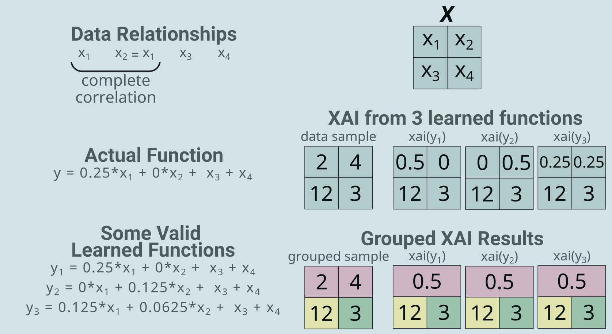
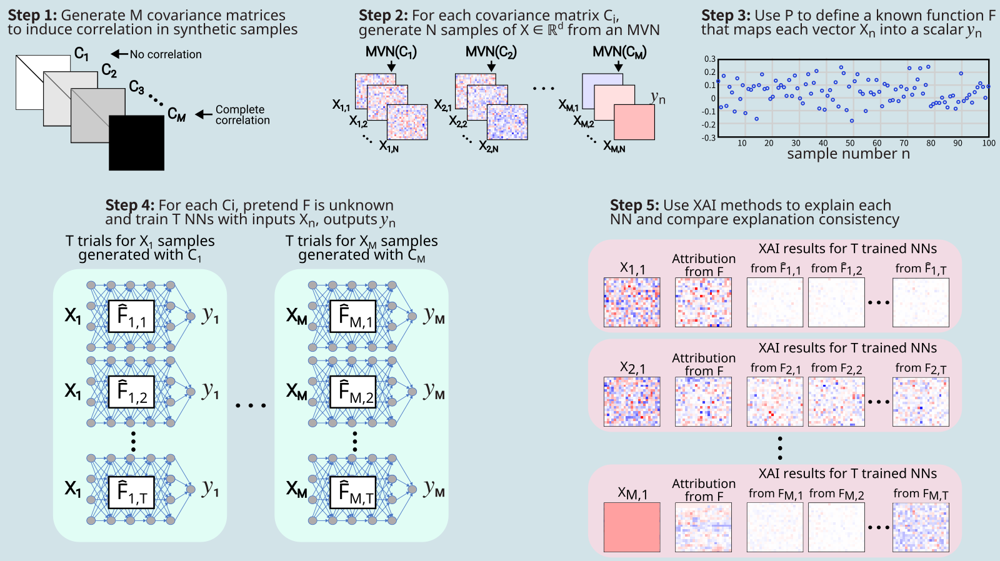

# Benchmark: Uniform Covariance Matrices

This is a very simple benchmark to demonstrate how the strength of correlation between grid cells influences the distribution of XAI results when retraining the model. 

- With correlated data, the model can learn different relationships and achieve similar performance.
- So, there is potential variation in the learned weights of the trained model.
- This means that the XAI outputs may also vary, even if they all correctly explain the model.
- This benchmark is really a set of benchmarks, where each benchmark uses a different covariance matrix.
- The covariance matrices are uniform: all grid cells have the same relationship.
- The covariances matrices used go from 0.0 (no correlation) to 1.0 (all values identical). 
- **Hypothesis: greater correlation --> greater variation in XAI results**. 

**Publication**

[Krell et al. (2024): Using Grouped Features to Improve Explainable AI Results for Atmospheric AI Models that use Gridded Spatial Data and Complex Machine Learning Techniques](https://ams.confex.com/ams/104ANNUAL/meetingapp.cgi/Paper/435616)

## Benchmark Design

## Motivating Toy Example

## Benchmark Design Pipeline

## Results

Comparison Plot IMAGE
