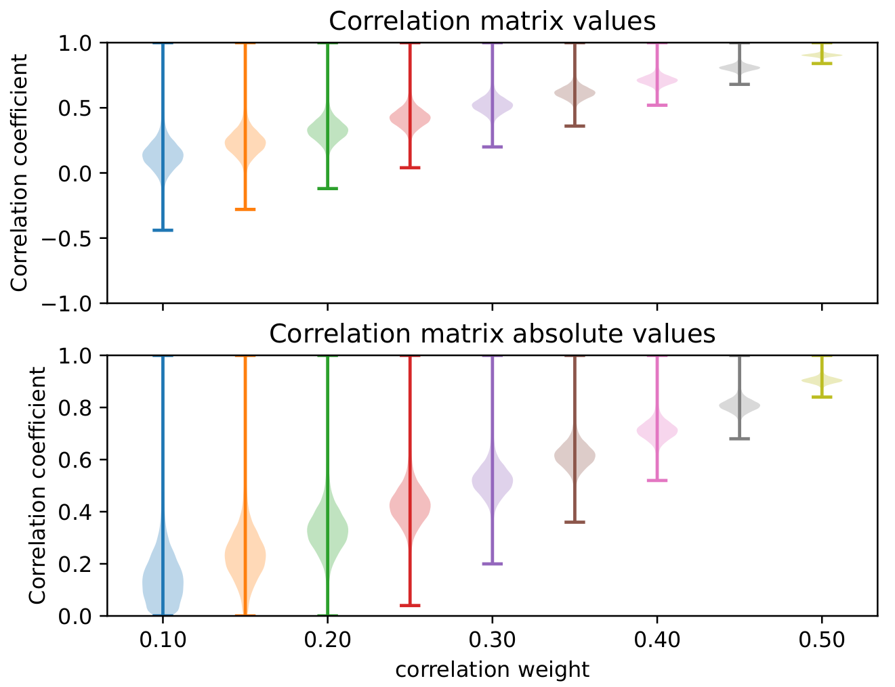

# `globalcov` Benchmark

The `globalcov` benchmark is part of the `varicov` benchmark family.
The scripts here actually produce a set of benchmark, based on changing the covariance matrix used to generate samples. 

`globalcov` is used to analyze how the strength of correlation among the samples influences the variance among XAI outputs with a set of trained models. That is, if there are more options for the model to learn (strong correlation), then it is expected that the model can learn many equally valid functions, causing the XAI-based model explanations to vary. Unlike `unicov` that induces a uniform correlation across all pixes, `globalcov` is based on a real dataset so that there is realistic spatial dependencies. These are then strengthed using the `strengthen_covariance.py` script.

The _global_ in `globalcov` refers to the origin of the based covariance matrix: [global sea surface temperature anomaly](https://psl.noaa.gov/data/gridded/data.cobe2.html). You can, of course, use any arbitrary covariance matrix to build a custom benchmark. Here, the goal was to use low-resolution data that is characterized more by long-range teleconnections than localized autocorrelation. 

## Build & evaluate 

    # Generate covariance matrices
    python  benchmarks/varicov/globalcov/strengthen_covariance.py \
        --covariance_file benchmarks/varicov/globalcov/sstanom_cov.npz \
        --output_dir benchmarks/varicov/globalcov/out \
        --weights 0.1,0.2,0.3,0.4,0.5,0.6,0.7,0.8,0.9

    # Build the set of benchmarks
    bash benchmarks/varicov/build_benchmarks.bash \
        benchmarks/varicov/globalcov/config_bmark.json \  # Benchmark configs
        benchmarks/varicov/globalcov/config_nn.json       # NN hyperparameters

    # Evaluate the XAI variance
    bash benchmarks/varicov/run_xai.bash \   
        benchmarks/varicov/globalcov/out/ \     # Output directory
        input_x_gradient \                   # Which XAI method to apply
        1,2,3,4,5,6,7,8,9,10                 # Which samples to include in plots

## Example outputs

Example: `compare_corrs.pdf`

Example: `corr_compare_summary.pdf`

Example: `performance_summary.pdf`

