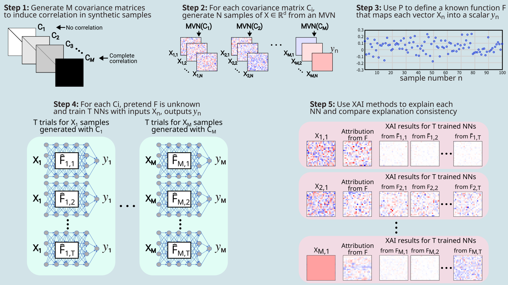

# `unicov` Benchmark

The `unicov` benchmark is a part of the `varicov` benchmark family. 
These are actually a set of benchmarks based on changing the covariance matrix used to generate samples.

`unicov` is a very simple benchmark to demonstrate how the strength of correlation between grid cells influences the distribution of XAI results when retraining the model. 

- With correlated data, the model can learn different relationships and achieve similar performance.
- So, there is potential variation in the learned weights of the trained model.
- This means that the XAI outputs may also vary, even if they all correctly explain the model.
- This benchmark is really a set of benchmarks, where each benchmark uses a different covariance matrix.
- The covariance matrices are uniform: all grid cells have the same relationship.
- The covariances matrices used go from 0.0 (no correlation) to 1.0 (all values identical). 
- **Hypothesis: greater correlation --> greater variation in XAI results**. 

**Publication**

[Krell et al. (2024): Using Grouped Features to Improve Explainable AI Results for Atmospheric AI Models that use Gridded Spatial Data and Complex Machine Learning Techniques](https://ams.confex.com/ams/104ANNUAL/meetingapp.cgi/Paper/435616)

## Benchmark Design

## Motivating Toy Example

## Benchmark Design Pipeline

**Note on covariance matrix**

- For each benchmark, two covariance matrices are needed
  1. Used to generate the samples 
  2. Used to induce spatial relationships between grid cells when defining known function F
- Here, a _uniform covariance matrix_ is used to generate samples (e.g. where cov = 0.5)
- And a _real geospatial covariance matrix_ is used for the known function F
  - Otherwise, each experiment has **two changes** instead of isolating to just the influence on sample correlation
  - The real covariance matrix comes from **SST anomaly** data (see the `sstanom` benchmark)

## Results

## Build & evaluate

    # Generate covariance matrices
    python benchmarks/varicov/unicov/generate_covariances.py \
        -o benchmarks/varicov/unicov/out/ \       # Output directory
        -r 20 -c 23                               # Size of rasters (rows, cols)

    # Build the set of benchmarks
    bash benchmarks/varicov/build_benchmarks.bash \
         benchmarks/varicov/unicov/config_bmark.json \  # Benchmark configs
         benchmarks/varicov/unicov/config_nn.json       # NN hyperparameters

    # Evaluate the XAI variance
    bash benchmarks/varicov/run_xai.bash \
      benchmarks/varicov/unicov/out/ \       # Output directory
      input_x_gradient \                     # Which XAI method to apply
      1,2,3,4,5,6,7,8,9,10                   # Which samples to include in plots

## Example outputs

* Based on the Krell et. all (2023) publication
* The default `config_bmark.json` and `config_nn.json` stored on GitHub match the publication

Example: `corr_compare_summary.pdf`

Example: `performance_summary.pdf`

